# Keycloak /  ASP.NET Core / Swagger Nswag
Esta aplicación es un ejemplo de como proteger ASP.NET core 2.2 con un servidor de autentificacion oauth2 Keycloak.
Tambien se implementa el consumo de la api con Nswag con OpenApi 3.

## Resumen
- Server
  - ASP.NET Core 2.2
  - Docker: keycloack server con base de datos mysql
- Client
  - Nswag. interfaz de usuario y el generador de Swagger

## Demo

## Setup

1. Instalación:
   - [.NET Core 2.2](https://www.microsoft.com/net/core)
   - [Docker](https://docs.docker.com/engine/installation/)

2. Ejecutar `docker-compose -f "docker-compose.yml"  up -d --build --remove-orphans`
3. Abrir el navegador [http://localhost:8080] [http://localhost:10001].

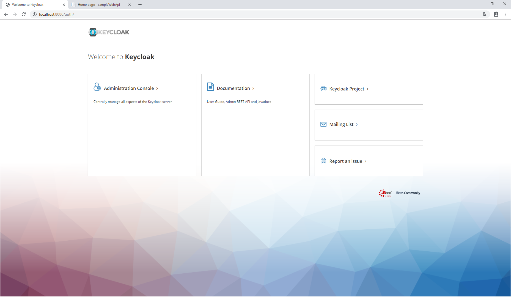 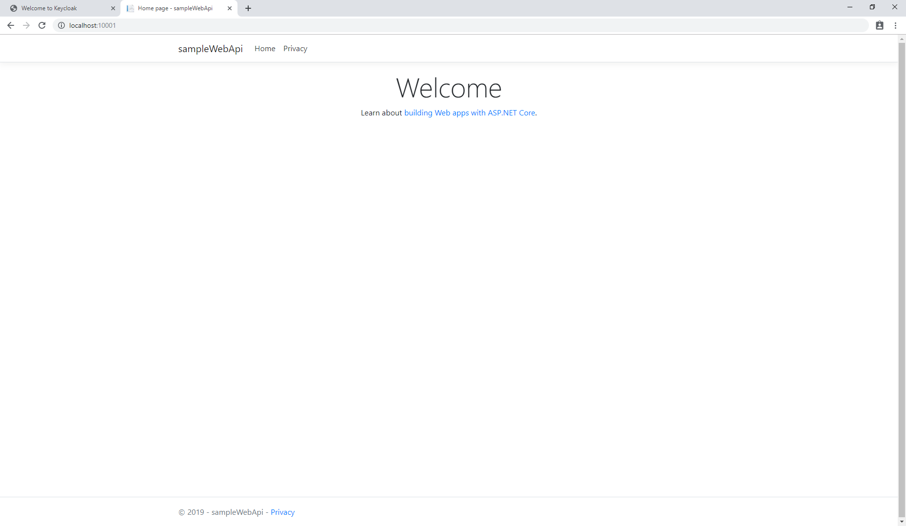

## Configuración

1. Modificacion de host.
   1. Se debe modificar el fichero 'C:\Windows\System32\drivers\etc\hosts'
        para que funcione localmente. Debemos añadir el nombre del contenedor de seguridad, ya que con localhost da problemas. Este nombre se puede
        modificar en el docker-compose

    `127.0.0.1       localhost  keycloalocalhost`

2. Configuracion de Keycloak.
   1. He dejado la exportación de configuración de un cliente para el ejemplo en [keycloak-Import/realm-export.json](./keycloak-Import/realm-export.json)

Pulsamos sobre Administrador console. Nos solicitara las credenciales.
Por defecto con docker-compose hemos creado el usuario **admin**, con contraseña **Pa55w0rd**
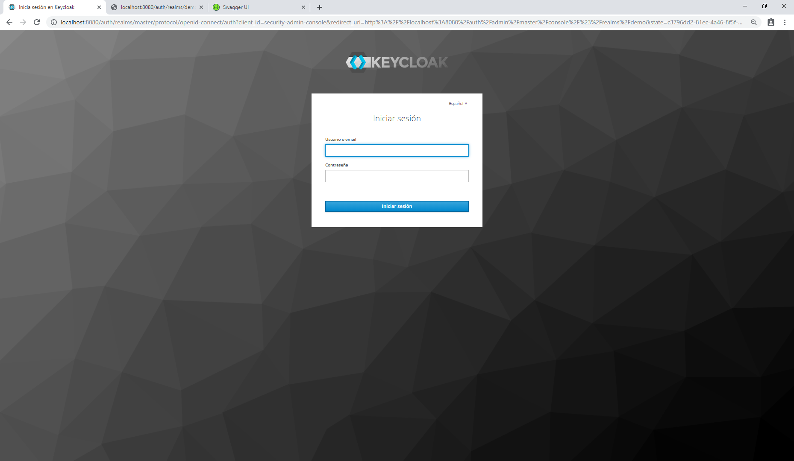

Para nuestro Entorno de pruebas crearemos nuestro Realm "Demo", para ello pulsamos sobre la add Realm
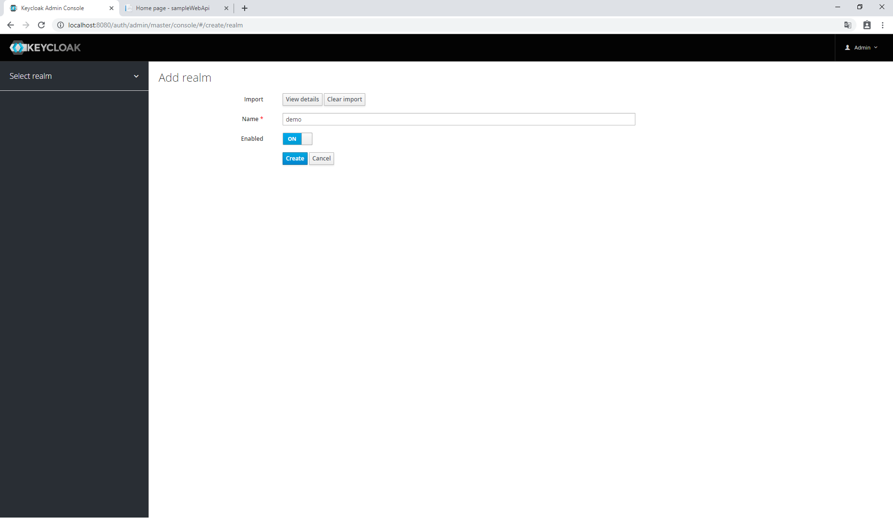

Vamos a la pestaña "Security Defenses" y permitimos todos los origenes
`X-Frame-Options : ALLOW-FROM *`

Importamos el cliente [keycloak-Import/realm-export.json](./keycloak-Import/realm-export.json)
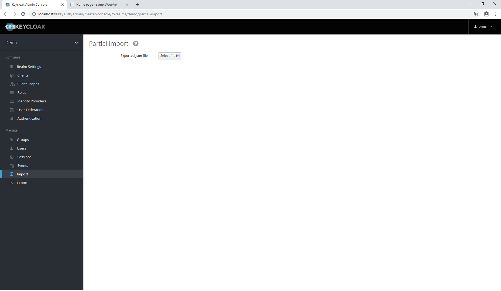

Validamos configuración
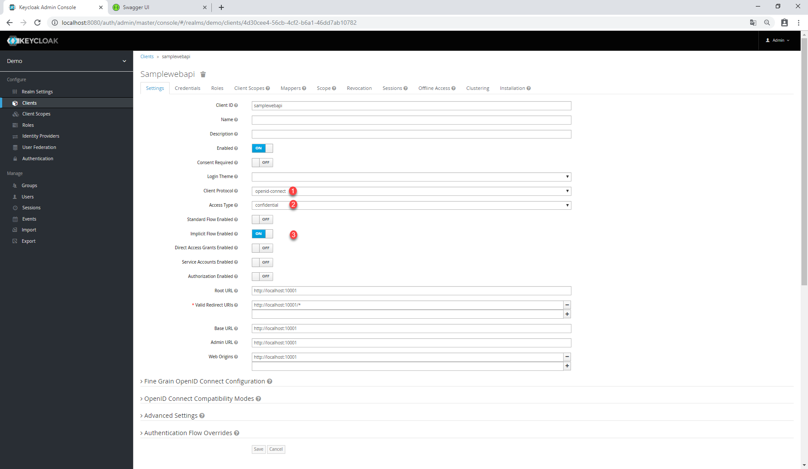

Generamos Secret key que debemos copiar para configurar el proyecto de Aspnet.core

Para consumir la api necestiamos añadir un usuario al cliente samplewebapi
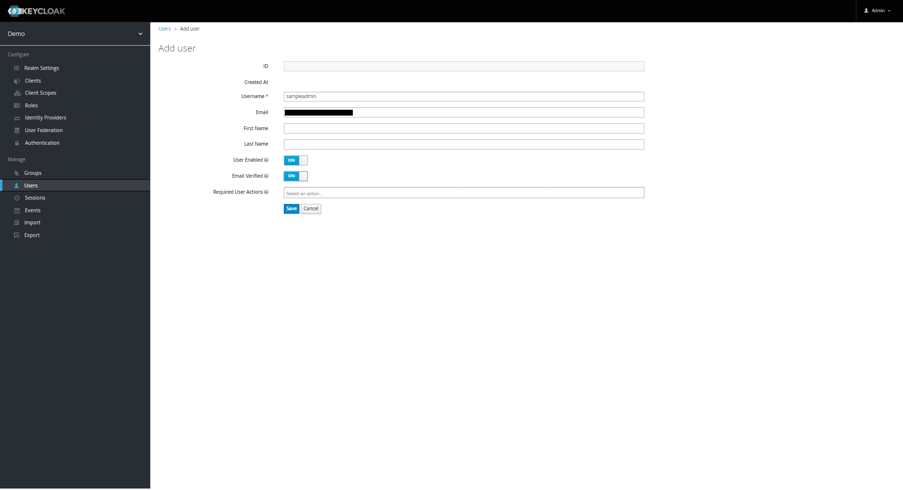

Le asignamos una contraseña

Validamos los Roles
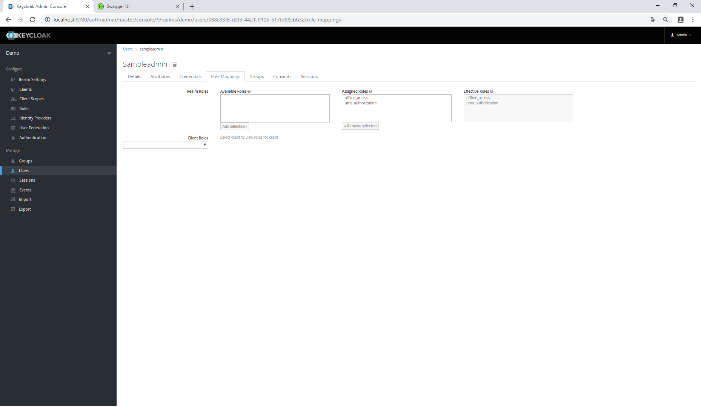

Para ver el esquema de autenficación de Keycloak nos situamos en Realm Setting

y pulsamos sonbre el Endpoints "OpenID Endpoint Configuration"
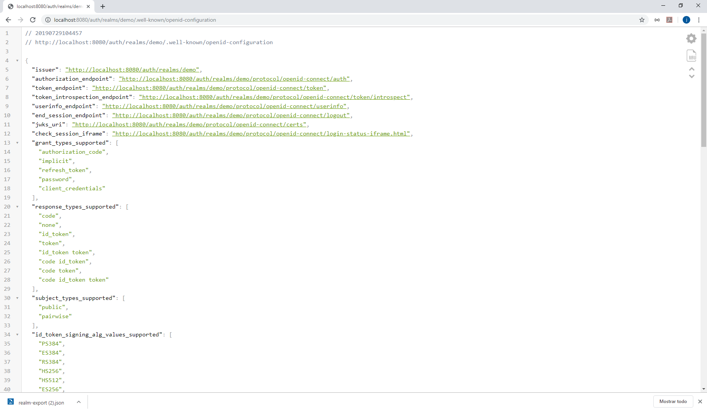

3. Configuracion Aspnet.
   Con los datos obtenidos del esquema de keycloak configuramos nuestro cliente.

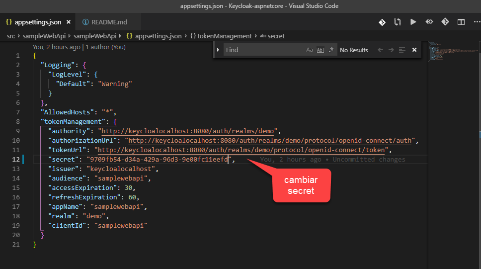

4. Probar:

Accerder a la url http://localhost:10001/swagger/
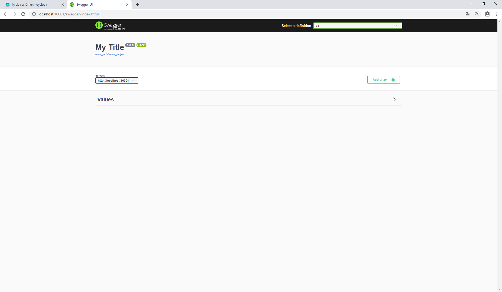

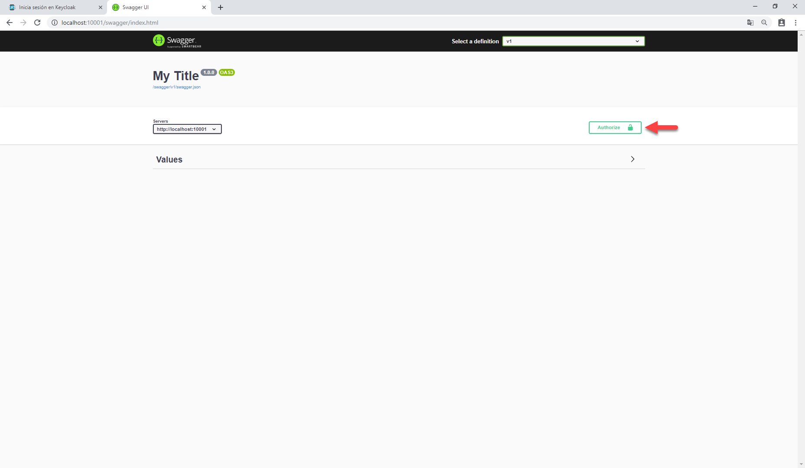

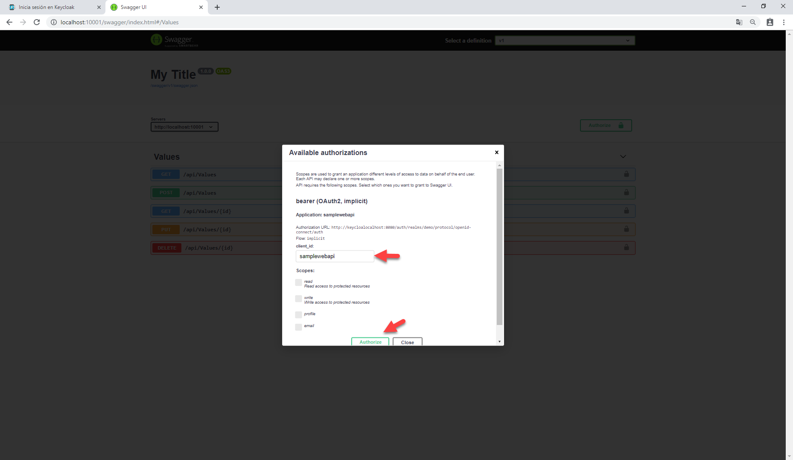

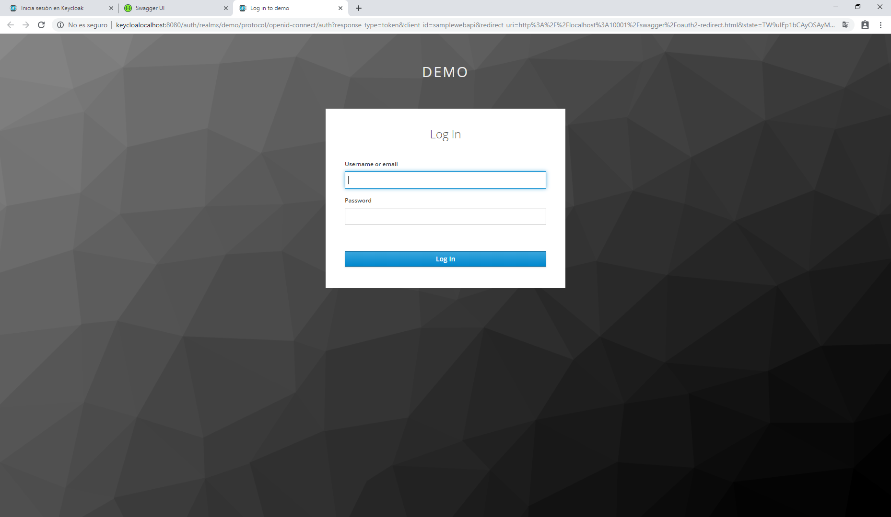

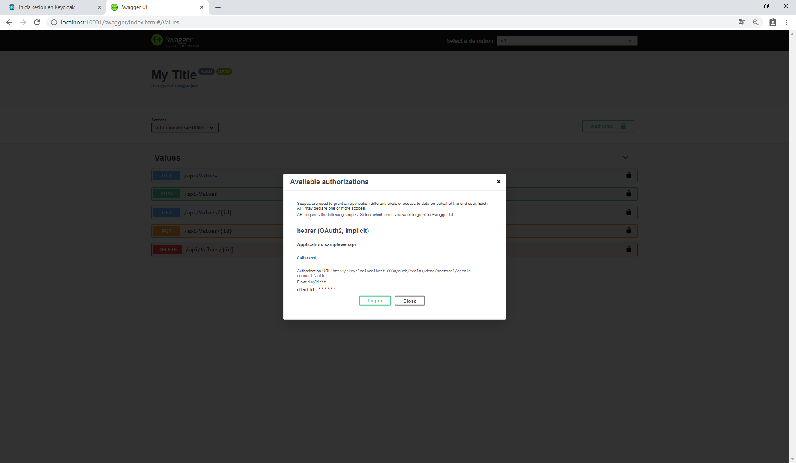

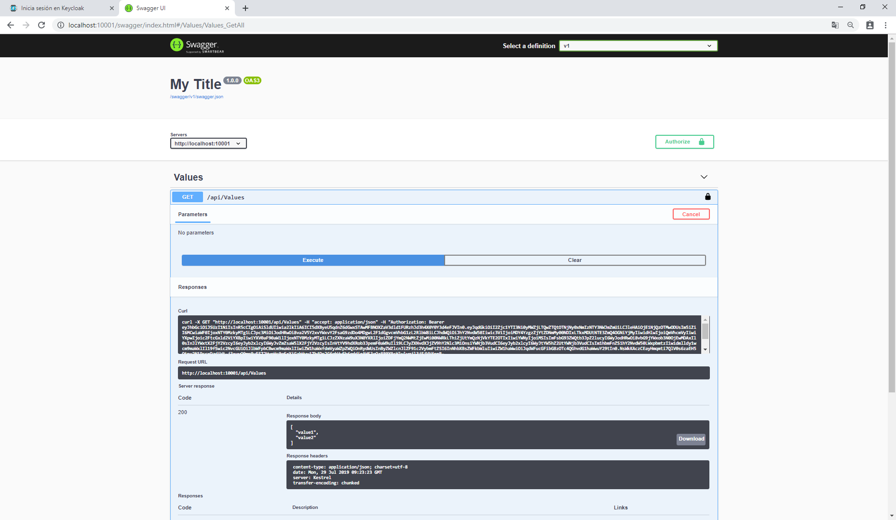

## Enlaces
[Visual studio Nswag](https://docs.microsoft.com/es-es/aspnet/core/tutorials/getting-started-with-nswag?view=aspnetcore-2.2&tabs=visual-studio)

[Nswag](https://github.com/RicoSuter/NSwag)

[Add OAuth2 authorization (OpenAPI 3)](https://github.com/RicoSuter/NSwag/wiki/AspNetCore-Middleware)

[KeyCloak Documentacion](https://www.keycloak.org/archive/documentation-6.0.html)

